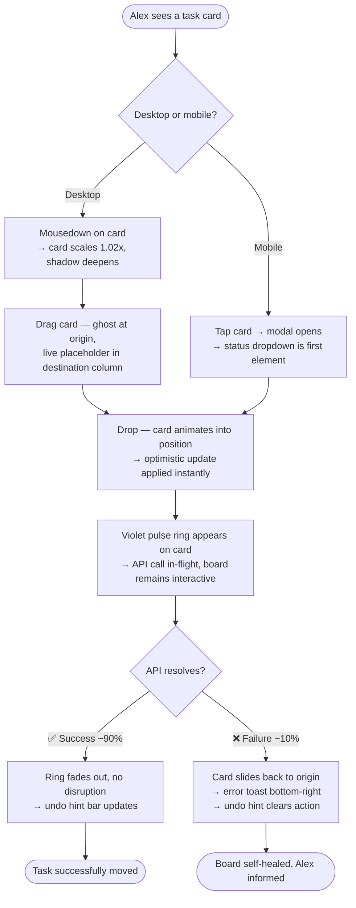
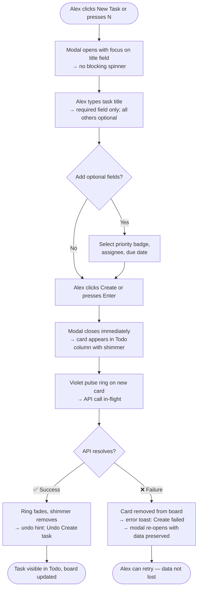
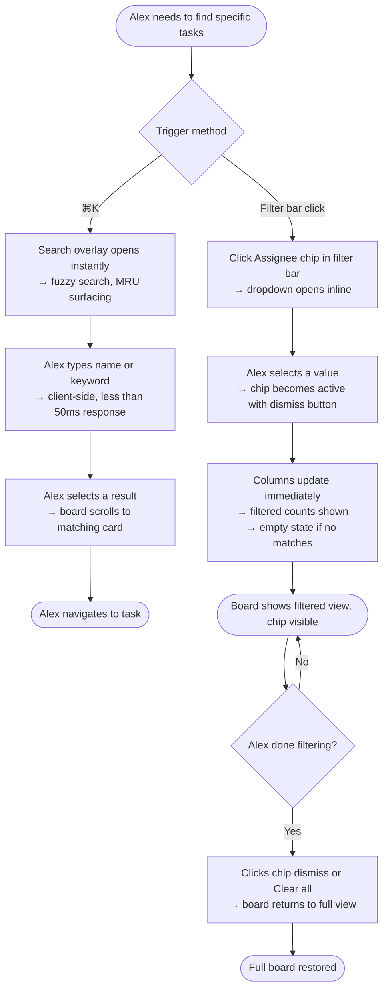
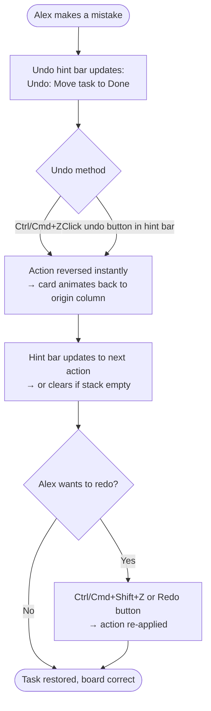
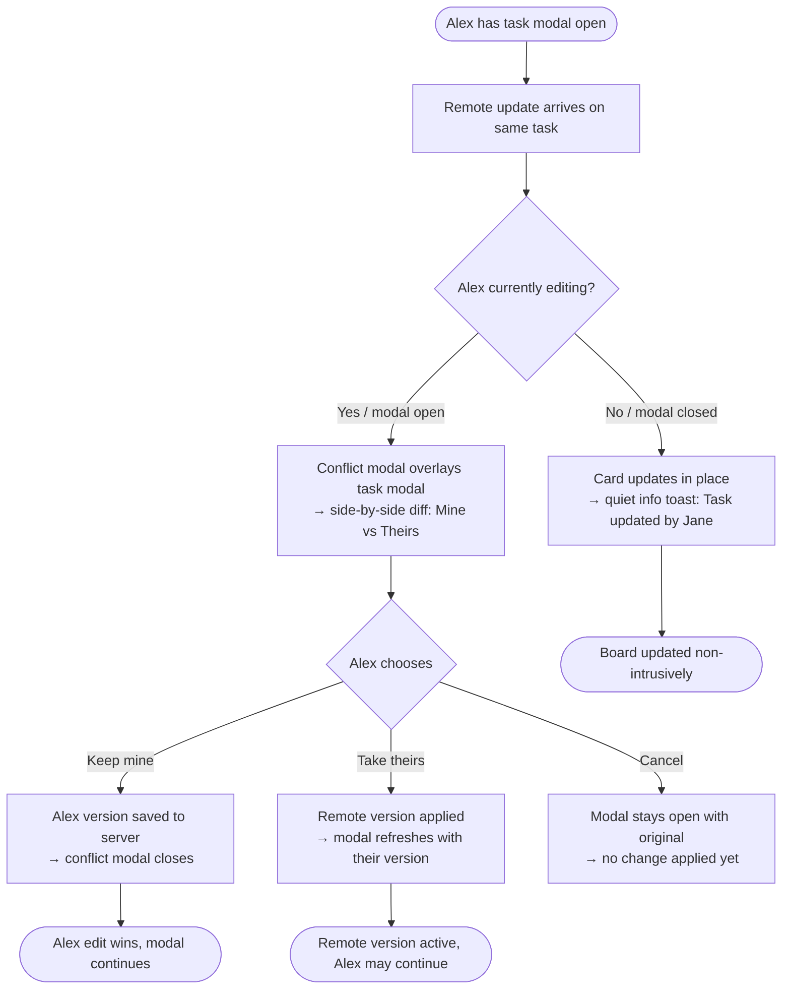

# UX Design Specification — Real-Time Collaborative Task Board

**Author:** Ali
**Date:** 2026-04-23

---

## Executive Summary

### Project Vision

A production-grade Kanban task board (Todo / In Progress / Done) with drag-and-drop, task CRUD, filtering, optimistic updates with rollback, real-time multi-user simulation, conflict resolution, undo/redo, and virtualized rendering for 1000+ tasks. Built with React 18, TypeScript strict, and Tailwind CSS.

### Target Users

**Alex** — a mid-level engineer using the board during sprints. Tech-savvy and task-oriented; primarily on desktop, occasionally mobile one-handed during stand-ups. He expects interactions to feel instant, errors to be transparent and recoverable, and the board to stay trustworthy even when things go wrong.

### Key Design Challenges

1. **Feedback layering without noise** — Optimistic in-flight states, rollback toasts, real-time update toasts, and conflict modals must coexist without overwhelming Alex.
2. **Trust through visual honesty** — The visual language for "committed," "in-flight," and "rolled back" must be unambiguous so failures feel recoverable, not broken.
3. **Undo/redo discoverability** — The hint label ("Undo: Move task to Done") needs to be always visible without cluttering the board.
4. **Conflict resolution context** — "Keep mine / Take theirs" is only safe if Alex can see what differs.

### Design Opportunities

1. **Skeleton + optimistic card insertion** — Task appearing instantly with a subtle in-flight shimmer instead of a blocking spinner.
2. **Undo hint bar as a UI signature** — A persistent compact bar (à la Figma) makes the undo/redo system visible and memorable.
3. **Tiered toast system** — Info / warning / error toasts with distinct visual weight and auto-dismiss timings give the board a coherent feedback language.

## Core User Experience

### Defining Experience

The heartbeat of the board is **moving a task to a different column** — drag-and-drop on desktop, status dropdown on mobile. This single action defines the product's value. Everything else — creation, filtering, undo, conflict resolution — exists in service of keeping that core loop fast, trustworthy, and forgiving.

### Platform Strategy

Web SPA targeting modern browsers. Primary context is desktop (mouse + keyboard); mobile is a genuine first-class citizen for one-handed use during stand-ups, not a polite afterthought. No offline support in MVP. Breakpoints: mobile < 768px (columns stack vertically), tablet 768–1024px, desktop > 1024px. Touch drag-and-drop degrades to a status dropdown — not hidden, deliberately surfaced.

### Effortless Interactions

- **Status change** (drag or dropdown) — instant, zero perceived latency via optimistic updates
- **Search and filter** — results update as Alex types, client-side, < 50ms
- **Undo** — Ctrl/Cmd+Z works exactly like any editor he's used before; no learning curve required
- **Task creation** — modal opens fast, minimal required fields, card appears immediately on submit without a blocking spinner
- **Rollback on failure** — the board self-heals automatically; Alex is informed but never left in a broken state
- **Remote updates** — external changes slide in non-intrusively; Alex is notified but not interrupted mid-action

### Critical Success Moments

1. **First drag** — if it feels sticky, jittery, or delayed, trust is lost immediately and never fully recovered
2. **First rollback** — if a failed update looks like a bug instead of a controlled recovery, confidence in the whole board evaporates
3. **First Ctrl+Z** — if it does something unexpected, the undo system becomes invisible to Alex forever

### Experience Principles

1. **Speed is honesty** — optimistic updates aren't a trick; they're a promise the UI reflects reality, and the board makes good on that promise transparently when things go wrong.
2. **Failure is a first-class citizen** — errors are handled so gracefully that Alex trusts the board *more* after seeing one recover cleanly.
3. **Control is always one keystroke away** — undo/redo means Alex never has to be afraid of making a change.
4. **Mobile is a real scenario, not a fallback** — the board works well one-handed, genuinely usable, not just technically responsive.

## Desired Emotional Response

### Primary Emotional Goals

**Confidence** — Alex feels in control because the board always shows him exactly what's true, explains when things go sideways, and gives him a way back out. The board earns trust not by being infallible, but by being honest and recoverable.

### Emotional Journey Mapping

| Stage | Target Emotion | Design Signal |
|---|---|---|
| First load | Oriented, calm | Familiar Kanban layout, instantly readable |
| During a drag | Satisfied, trusting | Instant response, smooth physics |
| After a rollback | Relieved, more trusting | Clean snap-back, clear explanatory toast |
| First Ctrl+Z | Empowered | Works exactly as expected, hint label confirms it |
| Real-time notification | Informed, not startled | Quiet info toast, non-intrusive placement |
| Mobile use | Pleasantly surprised | Genuinely usable one-handed, not just "responsive" |

### Micro-Emotions

- **Confidence** over confusion when scanning the board — clear visual hierarchy on task cards
- **Trust** over skepticism after a rollback — failure UX is as considered as success UX
- **Satisfaction** over frustration after drag-and-drop — interaction physics feel natural
- **Empowerment** over anxiety knowing undo is always one keystroke away
- **Calm** over overwhelm when real-time notifications appear — they inform, never interrupt

### Design Implications

- **Confidence → visual honesty** — in-flight states, loading indicators, and rollback animations are not hidden; they are prominent but visually calm
- **Trust after failure → recovery micro-copy** — "Update failed — your change was reverted" beats a generic error icon; language carries the emotional weight
- **Empowerment → persistent undo hint** — the hint bar is always visible, never collapsed or hidden
- **Calm → toast hierarchy** — info toasts (remote update) are visually quieter than error toasts (rollback); Alex's eye learns their weight instinctively

### Emotional Design Principles

1. **The board never lies** — every visual state is truthful; loading, committed, and rolled-back are always distinguishable
2. **Failure teaches trust** — a well-handled error makes Alex more confident, not less
3. **The way out is always visible** — undo is never more than one glance or one keystroke away
4. **Notification volume matches urgency** — info is a whisper, errors are a firm voice, never a shout

## UX Pattern Analysis & Inspiration

### Inspiring Products Analysis

**Linear** — Gold standard for instant feel. No spinners in the critical path; every transition reads as sub-100ms. Keyboard shortcuts are hover-discoverable. Task cards are information-dense but not cluttered — title dominates, metadata is secondary. The benchmark Alex silently compares everything against.

**Figma** — Two direct borrows: (1) The persistent undo hint bar ("Undo: Move layer") always visible at bottom — direct reference for FR31. (2) Corner-anchored, auto-dismissing, tiered toasts. Non-intrusive multiplayer presence as a secondary reference for real-time simulation notifications.

**Trello** — The original Kanban mental model. Card anatomy: title dominant, labels/badges as color signals, minimal metadata at a glance. Quick-edit on hover reduces modal fatigue for small changes. Column as a first-class visual concept.

**Notion** — Visually distinct toast hierarchy (info / warning / error at different weights). Inline editing reduces context-switching for small edits.

**GitHub Projects** — Per-card in-flight state: a subtle loading ring on the card being updated, not a global spinner. Status badge color coding (in-progress = yellow, done = green) is instantly scannable across the board.

**VS Code Command Palette** — Cmd+K: instant overlay, search-first, fuzzy matching, most-recently-used items surface first. Translates directly to our filter/search experience — keyboard-triggered, faster than an always-visible filter bar, discoverable without being mandatory.

### Transferable UX Patterns

| Pattern | Source | Applied To |
|---|---|---|
| Undo hint bar | Figma | FR31 — persistent label below board header |
| Corner-anchored tiered toasts | Figma | All notifications — info / warning / error |
| Per-card loading ring | GitHub Projects | In-flight optimistic update indicator |
| Title-first card anatomy | Trello | Task card — title large, priority badge, metadata small |
| Instant-feel no-spinner inserts | Linear | Task creation — card appears immediately with shimmer |
| Keyboard shortcut hover tooltips | Linear | All interactive elements |
| Cmd+K search overlay | VS Code | Filter/search — keyboard-triggered, fuzzy, MRU surfacing |

### Anti-Patterns to Avoid

1. **Jira's modal depth** — task creation/edit must never require more than one modal level
2. **Generic error toasts** — "Something went wrong" is useless; every error names the action and confirms the rollback
3. **Full-list refresh on remote update** — resets scroll position and feels like a bug; apply updates incrementally
4. **Toast stacking overflow** — more than 2–3 simultaneous toasts become noise; queue and coalesce
5. **No-undo edit anxiety** (Trello's pain) — the undo hint bar is the direct answer; always visible, never hidden

### Design Inspiration Strategy

**Adopt directly:**
- Figma's undo hint bar placement and copy pattern
- Figma's toast placement, tier system, and auto-dismiss timing
- Trello's title-first card anatomy and priority-as-color-badge
- GitHub Projects' per-card loading ring for in-flight states

**Adapt:**
- VS Code's Cmd+K palette → filter/search overlay (keyboard-first, also click-accessible)
- Linear's instant-feel card inserts → optimistic shimmer on task creation

**Avoid:**
- Jira's multi-step modal depth
- Generic, non-actionable error copy
- Full-list rerenders on remote updates
- Simultaneous toast overflow

## Design System Foundation

### Design System Choice

**shadcn/ui on Tailwind CSS** — component-owned primitives built on Radix UI, styled with Tailwind utility classes.

### Rationale for Selection

- **Stack-native** — Tailwind CSS is locked in by the PRD; shadcn/ui is the natural component layer on top
- **Copy-owned components** — no version lock, no library bloat; source lives in the repo and is fully customizable
- **Accessibility for free** — Radix UI primitives satisfy FR38–40 and NFR12–15 (focus traps, ARIA, keyboard nav) without custom implementation
- **Production aesthetic** — matches the Linear/Figma visual register Alex already trusts
- **Right components ship ready** — Dialog, Toast, Select, Badge, Button cover the non-custom surface area of the board

### Component Source Map

| Component | Source |
|---|---|
| Task create/edit modal | shadcn/ui `Dialog` |
| Toast notifications | shadcn/ui `Sonner` |
| Mobile status dropdown | shadcn/ui `Select` |
| Priority badges | shadcn/ui `Badge` |
| Form inputs, buttons | shadcn/ui primitives |
| Kanban columns + cards | Custom |
| Drag-and-drop | Custom with `@dnd-kit` |
| Virtual list | Custom with `@tanstack/react-virtual` |
| Undo hint bar | Custom |
| Filter/search overlay (Cmd+K) | Custom |

### Customization Strategy

Tailwind design tokens define: one neutral base palette, one accent color, consistent spacing scale, and border radius. All shadcn/ui components inherit these tokens automatically. Custom components (columns, cards, undo bar, search overlay) follow the same token vocabulary to ensure visual cohesion across the board.

## Defining Experience

### 2.1 Defining Experience

**"Move a task to done."**

Alex picks up a card, drops it in Done, and it lands instantly. That moment — card moves, no spinner, board feels alive — is the interaction that makes everything else credible. Get this right and the entire board feels trustworthy.

### 2.2 User Mental Model

Alex comes from Trello/Linear/Jira. Cards are physical objects; columns are states; drag is the natural verb. His baseline expectation: grab → drag → drop → done, with no confirmation dialog and no loading state blocking him. Optimistic update is not a feature to him — it's the expected behavior. When it works he doesn't notice; when it fails he needs to understand why without being alarmed.

### 2.3 Success Criteria

- Card lifts on mousedown — it visually confirms "grabbed"
- Placeholder appears in destination column during drag — Alex knows where it will land before he drops
- Drop is instant — card settles with a micro-animation, no spinner
- If API fails 2s later — card smoothly returns to origin, toast explains the rollback clearly
- The entire sequence is reversible with one Ctrl+Z

### 2.4 Novel UX Patterns

Drag-and-drop itself is deeply established (Trello, 2011). The novel layer is the **optimistic feedback system on top** — most Kanban boards either block on the API (spinner) or silently fail. Showing a visible per-card in-flight state *while the board remains fully interactive* is the differentiator. Alex can keep working; the board handles async truth in the background.

### 2.5 Experience Mechanics

**Desktop drag-and-drop:**

| Stage | User Action | Visual Signal |
|---|---|---|
| Initiation | Mousedown on card | Card scales 1.02x, shadow deepens — "grabbed" |
| Drag | Card follows cursor | Ghost card at origin (semi-transparent), live placeholder in destination |
| Drop | Mouse released | Card animates into position, shadow resets, subtle scale-in |
| In-flight | API call in progress | Subtle loading ring on card border |
| Success | API resolves | Ring fades out, no disruption to board |
| Failure (10%) | API rejects | Card slides back to origin, error toast bottom-right |
| Undo | Ctrl+Z | Card moves back, undo hint bar updates to reflect next action |

**Mobile status change:**
No drag. Tap card → modal opens → status field is the first interactive element → save → same optimistic update sequence fires as desktop.

## Visual Design Foundation

### Color System

**Theme: Zinc + Violet** — cool neutrals as structural backbone, single violet accent. Matches the Linear/Figma aesthetic register Alex already trusts.

| Role | Tailwind Token | Usage |
|---|---|---|
| Background | `zinc-50` | Page background |
| Surface | `zinc-100` | Column backgrounds |
| Card | `white` + `zinc-200` border | Task cards |
| Text primary | `zinc-900` | Card titles, headings |
| Text secondary | `zinc-500` | Metadata, dates, assignees |
| Accent | `violet-600` | Buttons, focus rings, links |
| Accent hover | `violet-700` | Interactive accent states |
| Success | `emerald-500` | Done column header, success toast |
| Warning | `amber-500` | In Progress column header, info toast |
| Destructive | `rose-500` | Error toasts, rollback states |
| Priority High | `rose-500` badge | Task card priority badge |
| Priority Medium | `amber-500` badge | Task card priority badge |
| Priority Low | `sky-500` badge | Task card priority badge |
| In-flight indicator | `violet-600` border ring | Card with active API call |

### Typography System

- **Font:** Inter (Tailwind/shadcn default) — same face Linear and Figma use; highly legible at 12–14px metadata sizes
- **Card title:** `text-sm font-medium` (14px) — dominant, readable at a glance
- **Card metadata:** `text-xs text-zinc-500` (12px) — assignee, date, secondary info
- **Column headers:** `text-sm font-semibold` + count badge
- **Undo hint bar:** `text-xs text-zinc-500` — present but quiet

### Spacing & Layout Foundation

- **Base unit:** 8px (Tailwind default spacing scale)
- **Card padding:** `p-4` (16px) — comfortable, not cramped
- **Card gap:** `gap-3` (12px) between cards in a column
- **Column gap:** `gap-4` (16px) between columns
- **Density target:** Linear-level — information-dense without feeling tight

### Accessibility Considerations

- `zinc-900` on `white` → 19:1 contrast ✅
- `violet-600` on `white` → 5.1:1 ✅ (WCAG AA)
- `rose-500` badge with white text → 4.6:1 ✅
- All Tailwind color defaults meet WCAG AA for primary elements (NFR15)
- Dark mode deferred to Phase 3 — token system designed to support it when added

## Design Direction Decision

### Design Directions Explored

Six visual directions were explored via an interactive HTML showcase (`ux-design-directions.html`):

| Direction | Character |
|---|---|
| A — Linear Classic | Compact cards, violet accent, undo bar, per-card loading ring |
| B — Minimal Focus | Spacious whitespace, typography-first, soft shadows |
| C — Dense Productivity | Maximum information density, always-visible metadata |
| D — Header Filter Bar | Prominent full-width filter strip between header and columns |
| E — Sidebar Filters | Persistent left sidebar with filter controls, narrower columns |
| F — Card-Rich | Description previews, tag chips, assignee avatar circles |

### Chosen Direction

**Direction D — Header Filter Bar**, with a light color theme (white backgrounds, zinc-100 column surfaces) matching the Zinc + Violet design foundation. The UI palette follows Linear's light aesthetic: Inter font, subtle borders, clean shadows, violet-600 accent.

### Design Rationale

Direction D wins on **discoverability and transparency**. The full-width filter bar makes the board's current filtered state impossible to miss — Alex always knows exactly what he's looking at. Active filter chips are visible and dismissible inline, so there is no confusion about why certain tasks aren't showing. It avoids sidebar clutter (E) while making filters far more prominent than a header-only approach (A, B, C). The light theme aligns with the Zinc + Violet palette and matches the Linear/Figma aesthetic register Alex already trusts.

### Implementation Approach

- **Header**: Board title with `layout-kanban` icon, View options button, "New Task" primary button — right-aligned
- **Filter bar**: Full-width strip below header — `⌘K` search field, vertical separator, active filter chips (×-dismissible), inactive filter dropdowns (Assignee, Priority, Tags), "Clear all" ghost button right-aligned; always visible, not collapsible in MVP
- **Undo hint bar**: Compact strip below filter bar, above columns — Undo action button with description text, Redo button, filter count indicator right-aligned
- **Columns**: Three equal-width columns (Todo / In Progress / Done) with count badges; standard card density (Direction A card anatomy)
- **Cards**: Title dominant (`text-sm font-medium`), priority badge with dot, assignee name, date right-aligned; "Add task" dashed button at column bottom
- **In-flight state**: Violet animated pulse border ring on card during API call; CSS spinner top-right of card
- **Toast notifications**: Bottom-right corner — error toast uses rose-50/red border, Lucide `alert-circle` icon, dismissible ×
- **Icons**: Lucide icon set throughout (shadcn/ui default) — `layout-kanban`, `search`, `plus`, `undo-2`, `redo-2`, `filter`, `sliders-horizontal`, `user`, `flag`, `tag`, `chevron-down`, `alert-circle`, `x`, `check`, `inbox`

## User Journey Flows

### Journey 1 — Move a Task Between Columns (Defining Experience)

Alex drags a card from one column to another on desktop, or uses the status dropdown on mobile.

**Flow Optimizations:**
- Card grab is immediate — first frame confirms "grabbed"
- Placeholder appears in destination before drop — Alex knows where it lands before releasing
- API failure is silent recovery, not a blocking error — board stays usable throughout
- Rollback toast names the action: "Update failed — change reverted" (never generic)

### Journey 2 — Create a New Task

Alex opens the task creation modal, fills in the minimum required fields, and submits.

**Flow Optimizations:**
- Modal has exactly one required field (title) — friction is minimal
- Card appears before API confirms — zero perceived latency
- On failure: modal re-opens pre-filled so Alex doesn't re-type

### Journey 3 — Filter and Find a Task

Alex needs to see only tasks assigned to himself, using ⌘K or the filter bar.

**Flow Optimizations:**
- Filter state is always visible via chips — Alex always knows the board is filtered
- Clear all is one click — no hunting for a reset button
- ⌘K is faster for power users; filter bar chips are discoverable for first-time use

### Journey 4 — Undo a Change

Alex accidentally moves a task and wants to reverse it immediately.

**Flow Optimizations:**
- Undo hint bar is always visible — no hunting for an undo affordance
- Hint text names the specific action, not just "Undo"
- 50-action stack — Alex never has to be afraid of making a change

### Journey 5 — Conflict Resolution

A remote collaborator updates a task that Alex is currently editing in the modal.

**Flow Optimizations:**
- Conflict modal shows a diff — "Keep mine / Take theirs" is only safe with context
- Non-editing path is a quiet info toast — Alex is informed but never interrupted
- Cancel leaves Alex exactly where he was — no data loss

### Journey Patterns

| Pattern | Applies To | Behavior |
|---|---|---|
| **Optimistic first** | Move, Create, Edit | UI updates before API confirms; result either commits or rolls back |
| **Named rollback** | Move, Create, Edit | Error toast always names the failed action; never generic |
| **Undo always available** | All mutations | Every user-initiated change is undoable; hint bar reflects current stack top |
| **Non-blocking async** | All in-flight states | Board remains fully interactive during API calls; spinner is per-card, never global |
| **Quiet vs. firm notifications** | Remote updates vs. failures | Info toasts for background events; error toasts for user-action failures |
| **Modal data preservation** | Create failure | If creation fails, modal re-opens with the data Alex already typed |

### Flow Optimization Principles

1. **Zero wait, zero doubt** — every action produces an instant visual response; Alex is never staring at a frozen screen
2. **Failures explain themselves** — every error state names the specific action and outcome, never a generic message
3. **Recovery is one gesture away** — undo is always a keystroke; conflict resolution is a single choice; filter reset is one click
4. **The board is always trustworthy** — even when things go wrong, the board converges to a correct state automatically; Alex never has to refresh or manually fix inconsistency

## Component Strategy

### Design System Components

shadcn/ui (copy-owned, Radix UI primitives) covers the non-custom surface area out of the box:

| Component | shadcn/ui Source | Used For |
|---|---|---|
| Task create/edit modal | `Dialog` | Journeys 2, 5 |
| Toast notifications | `Sonner` | All journeys |
| Mobile status dropdown | `Select` | Journey 1 (mobile) |
| Priority / status badges | `Badge` | All cards |
| Form inputs, buttons | Primitives | Modal, filter bar |
| Keyboard shortcut hints | `Tooltip` | All interactive elements |

### Custom Components

**1. Kanban Column** — Droppable column with header, task list, count badge, and "Add task" dashed button. States: default, drag-over (violet border highlight), empty (inline empty state). Accessibility: `role="region"`, `aria-label="[name] column, N tasks"`.

**2. Task Card** — Draggable, clickable card. States: default, hover (elevated border + shadow), dragging (scale 1.02x + deep shadow), in-flight (violet pulse border + spinner), done (0.65 opacity + strikethrough title). Variants: standard, compact, rich (description + tags + avatar). Accessibility: `role="button"`, `aria-grabbed`, keyboard drag via Space/Enter + arrows (FR38).

**3. Drag-and-Drop Layer (`@dnd-kit`)** — `DndContext` + `SortableContext` per column. Ghost: semi-transparent clone at origin. Placeholder: dashed slot in destination. Mobile: touch drag disabled — status `Select` used instead.

**4. Undo Hint Bar** — Persistent strip between filter bar and columns. States: empty ("Nothing to undo"), has action ("Undo: Move task to Done"), has redo. Anatomy: Undo button (icon + action text) + Redo button + stack depth indicator right-aligned. Accessibility: `aria-live="polite"`.

**5. Filter Bar** — Full-width strip with ⌘K search field, active chips (dismissible), inactive filter dropdowns, "Clear all" ghost button. Chip anatomy: icon + label + × dismiss. Active chips: violet-100 bg + violet border. Overflow: chips wrap to second line.

**6. ⌘K Search / Filter Overlay** — Keyboard-triggered overlay for fuzzy search and filter by assignee/priority/tag. MRU items surface first. Accessibility: `role="combobox"`, `aria-expanded`, focus trap, Escape closes.

**7. Virtual Task List (`@tanstack/react-virtual`)** — Row virtualizer per column, estimated item height 72px, overscan 5. Required for NFR3 (60fps at 1000+ tasks) and NFR5 (< 100ms filter).

**8. In-Flight Card State** — `cardPulse` CSS keyframe animation on card border (0→50→100% violet + glow) at 1.8s infinite, plus CSS spinner top-right. Applied to any card with a pending mutation; removed on API resolve or rollback.

**9. Conflict Resolution Modal** — Overlays task edit modal on remote collision. Two-column diff (Mine / Theirs), changed fields highlighted. Buttons: "Keep mine" (primary), "Take theirs" (secondary), "Cancel" (ghost). Accessibility: `role="alertdialog"`, focus trap, `aria-describedby` on diff.

### Component Implementation Strategy

- All custom components use Tailwind utility classes and the Zinc + Violet design tokens — no hardcoded hex values
- shadcn/ui components are copy-owned in `src/components/ui/`; customized via Tailwind theme, not library overrides
- Only two additional runtime dependencies beyond shadcn/ui: `@dnd-kit` (drag-and-drop) and `@tanstack/react-virtual` (virtualization)
- Radix UI primitives inside shadcn handle focus traps, ARIA, and keyboard nav for Dialog, Sonner, Select, and Tooltip; custom components add `role`, `aria-*`, and keyboard handlers manually

### Implementation Roadmap

| Phase | Components | Epics |
|---|---|---|
| Phase 1 — Core Board | Kanban Column, Task Card (standard + in-flight), Drag-and-Drop Layer, Task Create Modal, Toast | 1–3 |
| Phase 2 — Async & Undo | Undo Hint Bar, Rollback animation, Conflict Resolution Modal | 4–5 |
| Phase 3 — Filtering & Scale | Filter Bar, ⌘K Overlay, Virtual Task List | 6–7 |
| Phase 4 — Polish | Compact + rich card variants, Mobile status dropdown, Keyboard tooltips, Remote update toasts | 8–9 |

## UX Consistency Patterns

### Button Hierarchy

Three levels — only one primary action visible per context at a time:

| Level | Style | Usage |
|---|---|---|
| **Primary** | Violet-600 fill, white text | "New Task", "Create" in modal, "Keep mine" in conflict |
| **Secondary** | White fill, zinc border | "View", "Take theirs", filter dropdowns |
| **Ghost** | Transparent, zinc text | "Clear all", "Cancel", "Redo", "Add task" (dashed border) |
| **Destructive** | Rose-600 fill | Permanent destructive actions only (not used in MVP) |

Rules: Never two primary buttons side-by-side. Icon-only buttons (close, dismiss ×) are always ghost. Labels use imperative verbs: "Create", "Save", "Move" — never "OK" or "Submit".

### Feedback Patterns

**Toast hierarchy** — four tiers, distinct visual weight and auto-dismiss timing:

| Tier | Appearance | Timing | Example |
|---|---|---|---|
| Info | Zinc border, zinc icon | 4s auto-dismiss | "Task updated by Jane" (remote update) |
| Success | Emerald border, check icon | 3s auto-dismiss | "Task created" |
| Warning | Amber border, alert icon | 6s auto-dismiss | "Conflict detected" |
| Error | Rose border, alert-circle icon | Persistent until dismissed | "Update failed — change reverted" |

Rules: Max 3 simultaneous toasts — queue and coalesce beyond that. Stack bottom-right, newest on top. Every error toast names the specific action and outcome; "Something went wrong" is forbidden.

**In-flight states** — per card, never global: violet pulse border + CSS spinner top-right. Board remains fully interactive; no overlay, no disabled state during API calls.

**Loading states** — skeleton screens on initial board load only; never for subsequent updates.

### Form Patterns

- One required field (title) — all others optional and clearly labeled
- Inline validation: errors appear on blur, not on submit; rose-600 text + `alert-circle` icon below field
- Empty submit: focus returns to title field with inline error, no toast
- Tab order: Title → Priority → Assignee → Due Date → Create
- Modal closes on: success, Escape, or backdrop click — with unsaved-changes guard if fields are dirty
- **Unsaved changes guard:** "Discard changes?" with "Discard" (destructive) + "Keep editing" (primary); no guard if nothing was changed

### Navigation Patterns

**Keyboard shortcuts** (hover tooltip on every element that has one):

| Action | Shortcut |
|---|---|
| New task | `N` |
| Search / filter overlay | `⌘K` / `Ctrl+K` |
| Undo | `⌘Z` / `Ctrl+Z` |
| Redo | `⌘⇧Z` / `Ctrl+Shift+Z` |
| Close modal / overlay | `Escape` |
| Navigate cards | `Tab` / `Shift+Tab` |
| Open task | `Enter` on focused card |

**Focus management:** Modal open → focus to title field. Modal close → focus returns to trigger. ⌘K open → focus to search input. Toast → not auto-focused; dismissible when focused.

### Empty State Patterns

| Context | Icon | Heading | Sub-text | Action |
|---|---|---|---|---|
| Column with no tasks | `inbox` | "No tasks" | "Drag a task here or add one" | "Add task" ghost button |
| Filtered column, no matches | `filter` | "No matches" | "No tasks match the current filter" | "Clear filter" link |
| All columns empty after filter | `search` | "No tasks found" | "Try a different search or filter" | "Clear all filters" primary |

Rules: Every empty state has an icon, heading, sub-text, and an action. Sub-text is never "Nothing here yet."

### Drag-and-Drop Interaction Patterns

| Stage | Visual Signal |
|---|---|
| Hover on card | Cursor `grab` |
| Mousedown / drag start | Scale 1.02x, shadow deepens, cursor `grabbing` |
| Dragging | Semi-transparent ghost at origin; dashed placeholder in destination |
| Over valid drop target | Column border highlights violet |
| Drop | Card animates to position, shadow resets, scale returns |
| Invalid drop (same position) | Card snaps back with no animation |

## Responsive Design & Accessibility

### Responsive Strategy

**Desktop (> 1024px) — primary context:** Three equal-width columns side-by-side. Full filter bar always visible. Undo hint bar always shown. Drag-and-drop is the primary interaction verb. Columns grow with viewport width. All keyboard shortcuts active.

**Tablet (768–1024px) — adapted context:** Three columns remain side-by-side but narrower. Filter chips can wrap to a second row. Touch targets enlarged to minimum 44×44px. Drag-and-drop works via touch; status dropdown available as fallback. Undo bar remains visible.

**Mobile (< 768px) — first-class scenario:** Columns stack vertically (Todo → In Progress → Done), each full-width. Drag-and-drop replaced by status `Select` dropdown — surfaced as the first element when a card is tapped. Filter bar collapses to a single "Filter" button opening a bottom sheet. Undo bar remains visible. Tap targets minimum 44×44px throughout.

### Breakpoint Strategy

Tailwind default breakpoints map directly to the platform strategy:

| Breakpoint | Tailwind prefix | Layout |
|---|---|---|
| Mobile | default (< 768px) | Single-column stacked layout |
| Tablet | `md:` (768px+) | Three columns, touch-optimized |
| Desktop | `lg:` (1024px+) | Full layout, all features |

Approach: **mobile-first CSS** — base styles target mobile, `md:` and `lg:` progressively enhance. No custom breakpoints. Key rules: `flex-col md:flex-row` for column layout; `hidden md:flex` for filter chips (replaced by filter button on mobile); column min-width `280px` on tablet+.

### Accessibility Strategy

**Target: WCAG 2.1 AA** — industry standard, appropriate for a professional productivity tool.

**Color contrast (verified in visual foundation):**
- `zinc-900` on `white` → 19:1 ✅
- `violet-600` on `white` → 5.1:1 ✅
- `rose-500` badge (white text) → 4.6:1 ✅
- All badge text/background combinations meet 4.5:1 minimum

**Keyboard navigation (FR38):**
- Full board navigable via `Tab` / `Shift+Tab`
- Cards focusable; `Enter` opens; `Space` initiates keyboard drag
- Keyboard drag: `Space` picks up, arrow keys move between columns, `Space` drops, `Escape` cancels
- All modals trap focus (Radix UI `Dialog` handles this automatically)
- `Skip to main content` link at page top (visually hidden, visible on focus)

**Screen reader support (FR39):**
- Columns: `role="region"` + `aria-label="Todo column, 4 tasks"`
- Cards: `role="article"` with `aria-label` including title, priority, assignee
- In-flight card: `aria-busy="true"` while API call is pending
- Undo bar: `aria-live="polite"` — announces stack changes without interrupting
- Toast container: `aria-live="assertive"` for errors, `"polite"` for info/success
- Drag-and-drop: status announcements at drag start, over target, and on drop via `aria-live`

**Touch targets (FR40):** Minimum 44×44px for all interactive elements on mobile. Badge dismiss buttons padded to 44×44px touch area with `padding` expansion (visual size remains compact).

**Reduced motion:** All animations (card pulse, drag physics, toast fade, spinner) respect `prefers-reduced-motion: reduce` — transitions become instant or opacity-only fades.

### Testing Strategy

**Responsive:** Chrome DevTools simulation during development; real-device testing on iPhone (Safari) and Android (Chrome) for the mobile card-tap → status-dropdown → optimistic-update flow. Browser matrix: Chrome, Firefox, Safari, Edge — latest 2 versions.

**Accessibility:** axe-core integrated into component tests (flags WCAG AA violations at build time). Manual keyboard-only walkthrough of all 5 critical journeys. VoiceOver (macOS/iOS) for drag-and-drop announcements and `aria-live` region testing. Color blindness simulation for all badge and status colors.

### Implementation Guidelines

**Responsive development:**
- Tailwind responsive prefixes only (`md:`, `lg:`) — no custom breakpoints, no inline media queries
- Relative units: `rem` for font sizes, `%` for widths, `px` only for borders and icon dimensions
- Mobile-first: write base styles for mobile, layer enhancements with `md:`/`lg:`
- Test at 320px minimum viewport width

**Accessibility development:**
- Semantic HTML: `<button>` for actions, `<nav>` for navigation, `<main>` for board, `<article>` for cards
- No `
` or `` for interactive elements — use correct element or add `role` + keyboard handler
- `aria-label` on every icon-only button — describes the action ("Close toast"), not the icon ("X")
- Focus indicators: `focus-visible:ring-2 focus-visible:ring-violet-500` — never `outline: none` without replacement
- All color information also conveyed by shape, text, or icon — priority badges use dot + text label, never color alone
